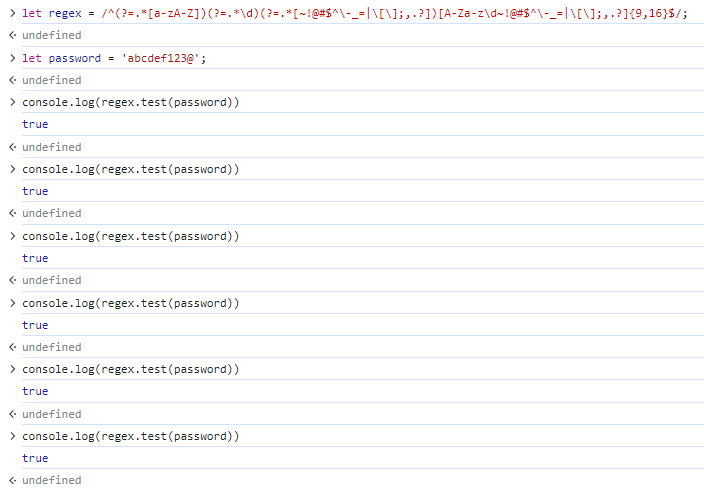
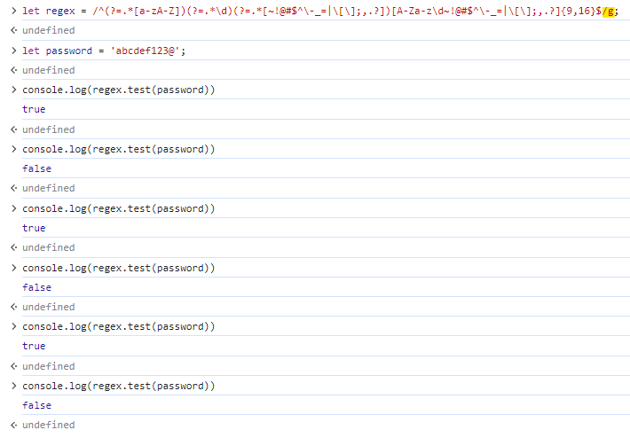

# ep13. [javascript] 정규표현식에 g플래그 포함할 경우

- 정규표현식과 test()메소드를 이용하여 비밀번호 유효성 검사를 진행하던 중, 전역플래그(g) 여부에 따라 결과가 다른 것을 알게 되었다.
    - 전역플래그 없을때 : 결과값이 항상 true
    

    - 전역플래그 있을때 : 결과값이 true와 false 반복
    

- `test()`는 주어진 문자열이 정규 표현식을 만족하는지 판별하고, 그 여부를 `true` 또는 `false`로 반환한다
- `test()`를 전역 탐색 플래그(/g)를 제공하는 정규표현식에서 여러번 호출하면, **이전 일치 이후부터 탐색한다.**
    - 이건 `exec()`도 마찬가지이고 `exec()`와 `test()`를 혼용하여 사용하는 경우도 마찬가지
    - 두 메서드는 정규표현식의 `lastIndex`를 업데이트 하는 방식으로 구현되어 있는데, 메서드를 호출하면 lastIndex에서부터 판별한다.
    - lastIndex는 초기값이 0이며, `test()`또는 `exec()`가 `true`를 반환할때마다 증가하게 된다. `false`를 반환하면 lastIndex는 다시 0으로 초기화된다.
        ```javascript
        let regex = /abc/g; // 전역플래그 g
        
        console.log(regex.lastIndex); // 0

        regex.test('abc'); // true
        console.log(regex.lastIndex); // 3

        regex.test('abc'); // false
        console.log(regex.lastIndex); // 0

        regex.test('abc'); // true
        console.log(regex.lastIndex); // 3

        regex.test('abc'); // false
        console.log(regex.lastIndex); // 0
        ```