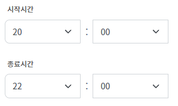
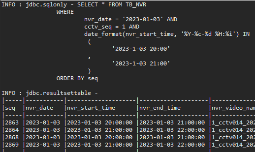
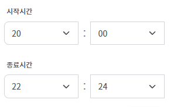
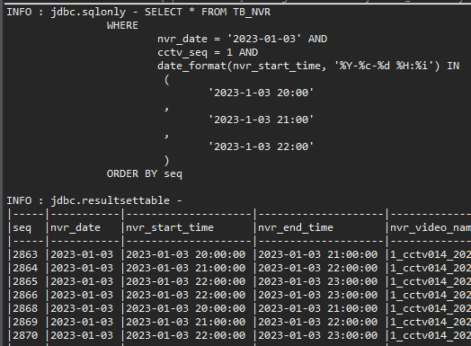

ep2. Mybatis에서 foreach사용하기 및 쿼리로그출력
=

>## 1. 상황
- Spring + MyBatis 프로젝트
- 사용자가 DB에 저장된 영상을 조회하고자 하는데, 영상은 1시간 단위로 저장이 되어있다.
- 아래와 같이 영상의 시작시간, 종료시간을 입력할 수 있을때   

    <image src="./image/2_1.png" style="margin:20px;">

    (1) <U>시작시간 20:00 ~ 종료시간 22:00 일 경우</U>   
    → 20:00 ~ 21:00, 21:00 ~ 22:00 이렇게 영상 2개가 조회되어야하고,

    (2) <U>시작시간 20:00 ~ 종료시간 22:30 일 경우</U>   
    → 20:00 ~ 21:00, 21:00 ~ 22:00, 22:00 ~ 23:00 이렇게 영상 3개가 조회되어야 한다.

<br>

---

<br>

코드를 어떻게 짜야하나 고민하다가,

<br>

**case 1. 종료시간이 hh:00인 경우**   
→ 종료시간이 hh:00 인 경우에는 시작시간~종료시간 사이 영상을 조회하면 된다.

**case 2. 종료시간이 hh:mm인 경우**   
→ 종료시간이 hh:mm 인 경우에는 시작시간~(종료시간+1) 사이 영상을 조회하면 된다.

<br>

이를 고려하여 작성한 코드는 아래와 같다.

<br>

```
int 반복횟수 = 0;
int startHour = 20; // 시작시간 20시
int endHour = 22; // 종료시간 22시
int endMin = 00 || 30 ; // 종료분(min) 0분 또는 30분

if(endMin == 00){
	반복횟수 = 종료시간(hh) - 시작시간(hh); // case1. 20:00 ~ 22:00 일때, 반복횟수는 22-20 = 2
}
else {
	반복횟수 = 종료시간(hh) - 시작시간(hh) + 1; // case2. 20:00 ~ 22:30 일때, 반복횟수는 22-20 = 2 + 1 = 3
}

int[] startTimeArr = new int[반복횟수];
for(int i=0; i<반복횟수; i++){
	startTimeArr[i] = (i + startHour); // case1. {20, 21}  , case2. {20, 21, 22}
}
```

<br>

사용자가 시작시간 20:00 종료시간 22:00을 선택했을때 DB에서 조회해야할 영상은 20:00 ~ 20:59,  21:00 ~ 21:59 이렇게 2개이다.   
→ 시작시간이 20시, 21시인 영상 2개가 필요

시작시간 20:00 종료시간 22:30을 선택했을때는 
22:00 ~ 22:59  영상 하나가 추가되어 3개이다.   
→ 시작시간이 20, 21, 22시인 영상 3개가 필요

<br>

이러한 시작시간들을 startTimeArr배열에 담아준 뒤

<br>

```
SELECT * FROM VIDEO
	WHERE
		date = #{date} AND 
		start_time IN (  ,   ,   , ... ) 
```

<br>

위와 같이 IN에다 해당 배열을 넣어주면 사용자가 원하는 영상을 조회할 수 있다.

<br>
<br>
<br>

>## 2. 해결
- MyBatis에서 IN안에다 배열을 넣어주기 위해서는 foreach문을 써야하는데, Mybatis에서 foreach문을 써본 적이 처음이라 잊어버리지 않기 위해 글을 작성하게 되었다.

<br>

(1) VO 필드추가   

쿼리문에 파라미터로 넣을 값이 VO이므로, VO에다 위에서 생성한 배열을 담아줄 필드를 하나 더 추가한다.

<br>

```
@Data
public class VideoVO {
	private int seq;
	private String date;
	private String start_time;
	private String end_time;
	private String video_name;
	private int cctv_seq;
	private String video_link;
	private String file_write_yn;
	private String image_link;
	private Time video_length;
	private String cctv_name;
	
	// 영상검색시, where절 IN 쿼리를 위한 배열
	private String[] startTime;
}
```

<br>

(2) 값 넣기

그 후 ServiceImpl에서 VideoVO의 startTIme필드에다 위의 startTimeArr배열을 넣어주었다.

<br>

```
VideoVO videovo = new VideoVO();
videovo.setstartTime = startTimeArr;
```

<br>

(3) 쿼리문 작성(video-mapper.xml)

<br>

```
<?xml version="1.0" encoding="UTF-8" ?>
<!DOCTYPE mapper
  PUBLIC "-//mybatis.org//DTD Config 3.0//EN"
  "http://mybatis.org/dtd/mybatis-3-mapper.dtd">

<mapper namespace="com.wkit.search.mapper.VideoMapper">
	<select id="searchListVideo" parameterType="VideoVO " resultType="VideoVO ">
		SELECT * FROM VIDEO
		WHERE 
			date = #{date} AND
			cctv_seq = #{cctv_seq} AND
			date_format(start_time, '%Y-%c-%d %H:%i') IN
			<foreach collection="startTime" item="hour" open="(" close=")" separator=",">
				#{hour}
			</foreach>
		ORDER BY seq
	</select>
</mapper>
```

<br>

foreach 태그를 보면 다양한 속성이 있는데,

<br>

- **collection** : 전달받은 인자값으로, 파라미터로 받아오는 VideoVO에서 foreach문에 사용할 필드명을 적어주면 된다. List또는 Array형태만 가능하다.
- **item** : for문을 돌며 collection에서 하나씩 빼오는 값을 지칭할 변수명이다. 나는 hour로 설정해주었다.
- **open** : foreach문이 시작될때 삽입할 문자
- **separator** : for문을 돌며 생성되는 item들을 구분해줄 구분자
- **close** : foreach문이 종료할때 삽입할 문자

<br>

foreach태그 안에는 item으로 설정해둔 hour를 mybatis 문법에 맞게끔 #{ }안에다 넣어주면 된다.

<br>
<br>
<br>

>## 3. 쿼리 로그 출력
- foreach문으로 IN안에 배열을 넣은 후, 생성된 쿼리문을 직접 보고 싶어졌다. 그래서 쿼리로그를 출력하기 위한 몇가지 설정을 해주었다.

<br>

(1) pom.xml에 dependency 추가
	
```
<dependency>
  <groupId>org.bgee.log4jdbc-log4j2</groupId>
  <artifactId>log4jdbc-log4j2-jdbc4</artifactId>
  <version>1.16</version>
</dependency>
<dependency>
	<groupId>org.lazyluke</groupId>
	<artifactId>log4jdbc-remix</artifactId>
	<version>0.2.7</version>
</dependency>
```

<br>

(2) WEB-INF/spring/root-context.xml 수정

```
<!-- 기존-->
<bean id="dataSource" class="org.springframework.jdbc.datasource.DriverManagerDataSource">
	<property name="driverClassName" value="com.mysql.cj.jdbc.Driver"></property>
	<property name="url" value="jdbc:mysql://localhost:3306/dbtest"></property>
	<property name="username" value="${jdbc.username}"></property>
	<property name="password" value="${jdbc.password}"></property>
</bean>
	
<!-- query log 출력 설정 -->
<bean id="dataSource" class="org.springframework.jdbc.datasource.DriverManagerDataSource">
    <property name="driverClassName" value="net.sf.log4jdbc.sql.jdbcapi.DriverSpy" />
    <property name="url" value="jdbc:log4jdbc:mysql://localhost:3306/dbtest"></property>
    <property name="username" value="${jdbc.username}"></property>
    <property name="password" value="${jdbc.password}"></property>
</bean>
```

기존 dataSource설정부분에서 driverClassName과 url을 위와같이 수정해준다.

<br>

(3) log4jdbc.log4j2.properties 생성
src/main/resources 밑에 log4jdbc.log4j2.properties 파일을 이름 그대로 생성해준다.

```
log4jdbc.spylogdelegator.name=net.sf.log4jdbc.log.slf4j.Slf4jSpyLogDelegator
log4jdbc.dump.sql.maxlinelength=0
```

<br>

(4) 결과

case 1.

	
	

<br>

case 2.
	
	
	    


<br>
<br>
<br>

>## 4. 덧붙이며
- mybatis를 오랜만에 사용하다보니 기억이 가물가물하다.
- 내가 사용한 방법 외에도 mybatis의 동적쿼리문 foreach 관련 문법이 다양하게 있던데 추후에 다시 자세하게 정리하는 시간을 가져보아야겠다.
