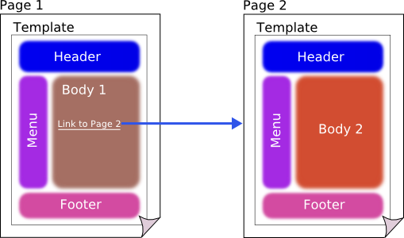
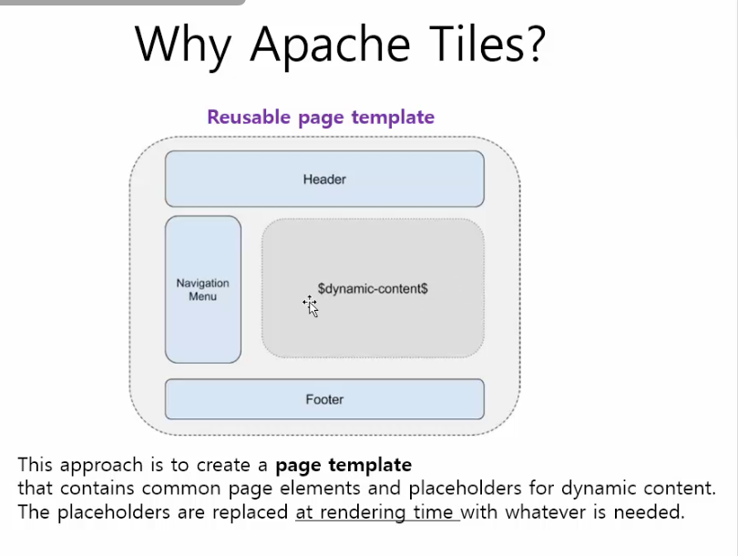
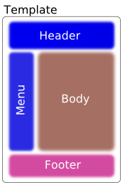
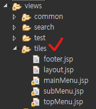

# ep3. [Framework] Apache Tiles 사용

## 1. Apache Tiles란
- https://tiles.apache.org/
- 중복된 코드를 제거하기 위해 Apache에서 제공하는 오픈소스
- runtime시에 page조각들을 구성해서 하나의 완성된 페이지를 출력
    <center>
        
    </center>
- page 1 과 page 2 는 서로 다르지만, 그 차이점은 본문인 Body에만 있다. Tiles를 이용하여 기본적인 레이아웃은 재사용하고 본문만 동적으로 변경할 수 있다.
- 만약 layout변경 이슈 발생시, layout에 관계된 페이지의 내용만 변경하면 되는 장점이 있다.
    <center>
        
    </center>
- 템플릿 생성 시 rendering할때 본문 body부분만 동적으로 주입되어 하나의 페이지가 출력됨.


## 2. Spring Legacy Project (Spring MVC Project) 에 Tiles 적용하기
- pom.xml에 추가
    ```xml
    <properties>
		<org.apache.tiles-version>3.0.3</org.apache.tiles-version>
	</properties>


    <dependency>
        <groupId>org.apache.tiles</groupId>
        <artifactId>tiles-api</artifactId>
        <version>${org.apache.tiles-version}</version>
    </dependency>
    <dependency>
        <groupId>org.apache.tiles</groupId>
        <artifactId>tiles-core</artifactId>
        <version>${org.apache.tiles-version}</version>
    </dependency>
    <dependency>
        <groupId>org.apache.tiles</groupId>
        <artifactId>tiles-jsp</artifactId>
        <version>${org.apache.tiles-version}</version>
    </dependency>
    <dependency>
        <groupId>org.apache.tiles</groupId>
        <artifactId>tiles-servlet</artifactId>
        <version>${org.apache.tiles-version}</version>
    </dependency>
    ```

- jsp 파일 생성
    - WEB-INF/views/tiles 밑에 레이아웃으로 쓸 jsp 파일을 추가한다. (body제외)
    - 그리고 layout.jsp라는 파일을 하나 더 생성해둔다.
    - layout.jsp 파일은 사용자가 추가한 header.jsp, nav.jsp, footer.jsp등을 어떻게 배치할지를 설정해 줄 jsp파일이다.
        <center>
            <table>
                <tbody>
                    <tr>
                        <td>
                            
                        </td>
                        <td>
                            
                        </td>
                    </tr>
                </tbody>
            </table>
        </center>

- tiles-context.xml 작성
    - WEB-INF/spring/appServlet 밑에 tiles-context.xml 파일을 작성한다. 
    - 파일 위치는 정해진게 아니지만, 웹 설정 파일인 servlet-context.xml과 함께 있는것이 좋다고 판단되어서 appServlet폴더 밑에 만들었다.
        ```xml
        <?xml version="1.0" encoding="UTF-8"?>
        <!DOCTYPE tiles-definitions PUBLIC
            "-//Apache Software Foundation//DTD Tiles Configuration 3.0//EN"
            "http://tiles.apache.org/dtds/tiles-config_3_0.dtd">

        <tiles-definitions>
            <definition name="layout" template="/WEB-INF/views/tiles/layout.jsp">
                <put-attribute name="title" value="DARA"/>
                <put-attribute name="mainMenu" value="/WEB-INF/views/tiles/mainMenu.jsp" />
                <put-attribute name="subMenu" value="/WEB-INF/views/tiles/subMenu.jsp" />
                <put-attribute name="topMenu" value="/WEB-INF/views/tiles/topMenu.jsp" />
                <put-attribute name="body" value="" />
                <put-attribute name="footer" value="/WEB-INF/views/tiles/footer.jsp" />
            </definition>
            
            <definition name="*/*" extends="layout">
                <put-attribute name="body" value="/WEB-INF/views/{1}/{2}.jsp" />
            </definition>
            
        </tiles-definitions>
        ```
    - 위와 같이 레이아웃으로 사용할 jsp를 설정해주면 된다. 이때 put-attribute에 name속성은 정해진 것이 없고 사용자임의로 작성이 가능하다. 
    - body속성은 빈 값 그대로 두고 아래쪽에 layout definition을 확장한 difinition을 추가로 작성하여, body속성에 들어갈 페이지들의 경로를 입력해주면된다. 나는 views밑에 폴더를 하나 생성 하여 해당 폴더 밑에 jsp파일을 넣을 것이므로 {1}/{2}.jsp로 입력하였다.
    - 만약 여러 경로를 등록하고 싶으면 아래와 같이 definition을 추가하면 된다.
        ```xml
        <!-- url형식이 */* 인 경우 -->
        <definition name="*/*" extends="layout">
            <put-attribute name="body" value="/WEB-INF/views/{1}/{2}.jsp" />
        </definition>
        <!-- url형식이 */*/* 인 경우 -->
        <definition name="*/*/*" extends="layout">
            <put-attribute name="body" value="/WEB-INF/views/{1}/{2}/{3}.jsp" />
        </definition>
        ```

- servlet-context.xml 추가
    ```xml
    <!-- Resolves views selected for rendering by @Controllers to .jsp resources in the /WEB-INF/views directory -->
	<beans:bean class="org.springframework.web.servlet.view.InternalResourceViewResolver">
		<beans:property name="prefix" value="/WEB-INF/views/" />
		<beans:property name="suffix" value=".jsp" />
		<beans:property name="order" value="2"/>
	</beans:bean>
	
	<!-- tiles -->
	<beans:bean id="tilesViewResolver" class="org.springframework.web.servlet.view.UrlBasedViewResolver">
		<beans:property name="viewClass" value="org.springframework.web.servlet.view.tiles3.TilesView" />
		<beans:property name="order" value="1" />
	</beans:bean>
	
	<beans:bean id="tilesConfigurer" class="org.springframework.web.servlet.view.tiles3.TilesConfigurer">
		<beans:property name="definitions">
			<beans:list>
				<beans:value>/WEB-INF/spring/appServlet/tiles-context.xml</beans:value>
			</beans:list>
		</beans:property>
	</beans:bean>
    ```
    - 기존 ViewResolver에다가 order 속성을 추가하여 값을 2로 할당한다.   
    그리고 tilesViewResolver를 등록하여 order 속성에 1을 할당한다.
    - 이는 dispatcher servlet에서 요청에 맞는 view를 viewResolver에게 찾아달라 요청할때,   
        1) tilesResolver를 먼저 읽어들여서 tiles에 설정해둔 레이아웃을 미리 적용한 후, 
        2) 기존 ViewResolver를 통해 사용자가 요청한 페이지를 tiles의 Body부분에다 동적으로 추가하기 위함이다.
    - 즉, 기존 viewresolver보다 tilesViewResolver를 먼저 적용해야 tiles에 설정해둔 레이아웃을 적용할 수 있으므로 order라는 속성을 이용하여 순서를 지정한 것이다.
    - 마지막으로 tilesConfigurer를 등록하여 tiles 설정 xml파일 경로를 추가해준다.

- layout.jsp 작성
    - 모든 설정이 끝났으니 마지막으로 레이아웃을 잡아준다. 
    - tiles를 거치는 모든 페이지들은 전부 layout.jsp에서 body부분만 바뀌어가며 출력되다보니, 대부분의 페이지에서 사용할 link나 script등이 있다면 layout.jsp에다 추가해두는 것이 좋다.
        ```jsp
        <%@ page language="java" contentType="text/html; charset=UTF-8"
        pageEncoding="UTF-8"%>
        <%@ taglib uri="http://tiles.apache.org/tags-tiles" prefix="tiles"%>
        <!DOCTYPE html>
        <html>
            <head>
                <meta charset="UTF-8" />
                <title>
                    <tiles:getAsString name="title"/>
                </title>
            </head>
            <body>
                <tiles:insertAttribute name="mainMenu"/>
                <tiles:insertAttribute name="subMenu"/>
                <main class="main-content position-relative wrapper bg-gray-50">
                    <tiles:insertAttribute name="topMenu"/>
                    <tiles:insertAttribute name="body"/>
                </main>
                <tiles:insertAttribute name="footer"/>
            </body>
        </html>
        ```
    - tiles의 taglib를 jsp 상단에 추가해주고, head태그의 title은 좀 전 tiles-context.xml에서 설정한 title값을 getAsString을 이용하여 추가해준다. tiles를 거치는 모든 페이지는 이제 동일한 title값을 갖게된다.
    - body태그에는 titles:insertAttribute 태그를 이용하여 tiles-context.xml에서 설정해둔 각각의 영역들을 추가한다. 이때 name은 tiles-context.xml에 있는 이름과 동일해야 한다.
    - 만약 같은 태그 내에 존재해야 하는 속성이 있다면 아래와 같이 html태그를 사용하여 함께 묶어줄 수도 있다.
        ```html
        <main class="main-content position-relative wrapper bg-gray-50">
            <tiles:insertAttribute name="topMenu"/>
            <tiles:insertAttribute name="body"/>
        </main>
        ```
- 동작 확인하기
    - tiles-context.xml에 작성해둔 경로에 body로 쓰일 jsp파일들을 추가해두고 (/WEB-INF/views/{1}/{2}.jsp)   
    definition에서 설정한 url양식으로 mapping주소를 설정한 뒤 프로젝트를 실행해보면, tiles가 적용된 페이지를 확인할 수 있다.