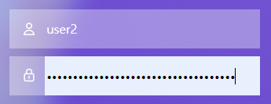

# ep5. [CSS] 크롬 자동완성 로그인, input 태그 배경색상 없애기
- 해결하고나니 큰 문제는 아니었지만, 해결방법을 찾는데까지 걸린 시간이 생각보다 길어졌다. 
- 그 시간이 아까워서라도 꼭 작성해야겠다 싶어 다섯번째 에피소드로 기록해두려 한다.

## ISSUE
- 크롬 자동완성 기능으로 로그인 시, 로그인 input창 배경색이 변하는 기능이 있다.
- 프로젝트 구현 중 클라이언트로부터 이에 대한 수정사항이 발생
    > "배경색이 변하지 않도록 해주세요!"
## 해결방법
### (1) 첫번째, autocomplete="off" 를 이용하여 자동완성 기능 제거
```html
<form action="/login" method="POST" autocomplete="off">
    <input class="input-id" type="text" id="user_id" name="user_id" placeholder="ID" autocomplete="off"/>
    <input class="input-password" type="password" id="inputPassword" name="user_pwd" placeholder="PASSWORD" autocomplete="off"/>
</form>
```
- 구글링을 통해 알아낸 바, input태그에 autocomplete="off" 속성을 주면 자동완성 기능을 막아준다고 했지만 소용이 없었다.
- [[참고]w3chools](https://www.w3schools.com/Tags/att_input_autocomplete.asp)

### (2) 두번째, 선택자 :-webkit-autofill 설정
```css
input:-webkit-autofill {
    -webkit-box-shadow: 0 0 0 30px none inset; 
    -webkit-text-fill-color: #000; 
}
```
- **autofill이란?** input요소의 값이 브라우저에 의해 자동으로 채워질때 동작함
- 자동완성 기능을 완전히 막고자 했지만, 이는 포기하고 자동완성이 되더라도 배경색이 변하지 않도록 제어하고 싶었다.
- 하지만 이 또한 소용이 없었다.😂

    

### (3) 세번째, 선택자 :-webkit-autofill 설정 + hover/focus/active 추가
```css
input:-webkit-autofill {
    -webkit-box-shadow: 0 0 0 30px none inset; 
    -webkit-text-fill-color: #000; 
}

input:-webkit-autofill,
input:-webkit-autofill:hover,
input:-webkit-autofill:focus,
input:-webkit-autofill:active { 
    /* transition : property-name | duration | easing-function | delay */
    transition: background-color 5000s ease-in-out 0s; 
}
```
- 이렇게 변경하니 드디어 자동완성시에도 배경색이 변하지 않게 되었다!

    

- hover, focus, active 별로 input태그가 autofill이 될 때 background-color에 대한 애니메이션을 5000s로 동작하게끔 설정해둠으로써, **배경색을 변하지 않도록 막은 것이 아니라 변하는 동작을 최대한 느리게 설정(5000s, 0s(딜레이 없이))해두어 배경색이 변하지 않는 것 처럼 보이게 해주었다 !**
    - 이렇게 해야만 하는 이유는, 브라우저별로 기본 사용자 스타일 시트가 존재하는데 크롬의 경우 다음과 같다.
        ```css
        background-color: rgb(232, 240, 254) !important;
        background-image: none !important;
        color: -internal-light-dark(black, white) !important;
        ```
    1. 코드를 확인해보면, !important 가 적용되어 input요소의 값이 브라우저에 의해 자동으로 채워질때(:autofill) background-color, background-image, color(font) 속성은 재정의가 불가능함을 알 수 있다.
    2. 재정의가 불가능하기 때문에, 이에 따라 font-color의 경우 **text-fill-color**(비표준)을 이용하여 제어하고 background-color의 경우 **box-shadow와 transition을 이용**하여 마치 배경색을 없앤 것처럼 애니메이션을 걸어둔 것이다!
    3. 정리하자면 input 요소가 autofill이 될 때, 크롬에서 설정해둔 배경컬러인 rgb(232, 240, 254) 로 변하는 것은 불가피하나, 적용시간은 딜레이 없이 5000s동안 진행되도록 설정 !
    4. background-color가 rgb(232, 240, 254) 로 변경되는데까지 5000s 시간이 걸리다보니 마치 배경컬러가 변하지 않는 것처럼 보임.
- 참고링크
    1. [Input 태그 자동완성 시 배경색 변경](https://velog.io/@docchi/input-%ED%83%9C%EA%B7%B8-%EC%9E%90%EB%8F%99%EC%99%84%EC%84%B1-%EC%8B%9C-%EB%B0%B0%EA%B2%BD%EC%83%89-%EB%B3%80%EA%B2%BD)
    2. [CSS-TRICKS](https://css-tricks.com/snippets/css/change-autocomplete-styles-webkit-browsers/)
    3. [mdn-web-docs : 의사클래스](https://developer.mozilla.org/ko/docs/Web/CSS/Pseudo-classes)
    4. [mdn-web-docs : autofill](https://developer.mozilla.org/en-US/docs/Web/CSS/:autofill)
    5. [mdn-web-docs : webkit-text-fill-color](https://developer.mozilla.org/en-US/docs/Web/CSS/-webkit-text-fill-color)
    6. [CSS : transition](https://developer.mozilla.org/en-US/docs/Web/CSS/transition)
  

        
