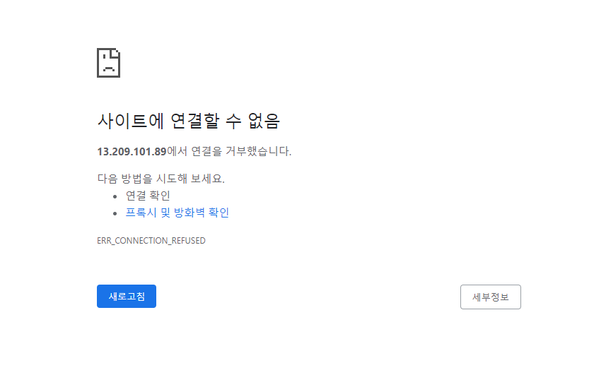
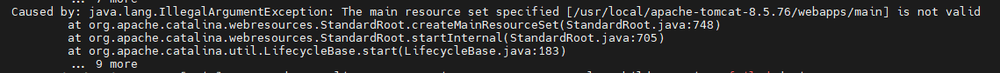
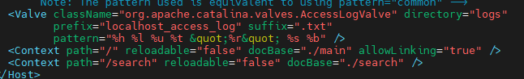
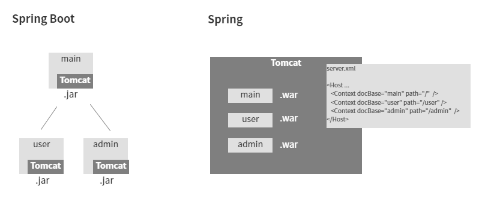

ERROR LOG_1. EC2 서버배포
=

>## 1. 상황
1. 퍼블리싱이 끝난 후, .jsp가 추가된 spring 프로젝트를 생성해둔 EC2웹 서버에다 올려 배포해보려고 한다.
2. 배포할 프로젝트 선택하여 우클릭 → Run as → Maven Clean → Maven build... ( 첫 build일 경우에 Maven build...를 선택, 그 외 Maven build)
3. Goals에 package 입력 → Apply → Run
( * [참고]maven 명령어 : [https://wikidocs.net/18341](https://wikidocs.net/18341) )
4. 파일탐색기 이용하여 해당 프로젝트 내 target파일로 이동 ( C:\~~~~\DARA2.0_Search\target )
5. search-1.0.0-BUILD-SNAPSHOT.war 확인
6. mobaxterm켜서 해당 war파일 업로드
7. 디렉토리 이동 : cd home/ec2-user/
8. 해당 디렉토리에 있던 war파일을 tomcat으로 이동 : sudo mv search-1.0.0-BUILD-SNAPSHOT.war /usr/local/apache-tomcat-8.5.76/webapps/
9. webapps/로 이동 : cd /usr/local/apache-tomcat-8.5.76/webapps/
10. war파일 이름 search로 변경하기 : mv search-1.0.0-BUILD-SNAPSHOT.war search.war
(tomcat의 server.xml에 <Context path=”/search” docBase=”./search” /> 로 설정해뒀음. 여기서 path는 경로명, docBase는 war이름 !! )
11. ls 로 이름이 잘 변경되었는지 확인.
12. 톰캣에 bin폴더로 이동 : cd /usr/local/apache-tomcat-8.5.76/bin/
13. 톰캣 구동시키기 : ./startup.sh (* 톰캣 종료 : ./shutdown.sh)
14. [http://13.209.101.89:8080/](http://13.209.101.89:8080/) 들어가서 확인
15. 아래와 같은 화면 표시 😨
    

>## 2. 우선 에러로그를 확인해보자
1. apache-tomcat-8.5.76/logs/ 에 있는 catalina.out 조회
    ```
    - catalina.out : 서버상에서 발생한 모든 내용(서버의 기동,정지,개시 등)을 기록한 파일이다.
    그렇기 때문에 생기는 로그의 양이 방대하다. 
    날짜별, 혹은 시간별로 로그를 분리하는것은 일반적으로 catalina.out에 사용한다.

    - catalina.yyyy-mm-dd.log : 톰캣에서 생기는 로그만을 기록한다.
    (Standard output(표준 스트림), Standard error(표준에러)의 로깅은 제외)

    - host-manager.log : Tomcat Host Manager Web app 로그 (가상호스트 매니저)

    - manager.log : Tomcat Manager Web App 로그 (웹콘솔)

    - localhost.log : host(특정 가상호스트 대상)한정 로그

    [출처] https://anggeum.tistory.com/11
    ```
   
    
    webapps 밑에 main이 없다는 에러가 떴다.

    현재 개발하는 솔루션은 main.war에서 로그인을 실행한 뒤 각각의 하위 서비스로 들어가는 플로우이므로, main.war 없이 서비스 모듈 하나만 배포하여 생긴 문제였다.

    우선 server.xml에서 메인프로젝트와 서비스 모듈 경로를 확인해줬다.
    
    ( 여기서 path는 각 모듈의 경로이고(중복불가), docBasc는 war의 이름이다. )
    그런 후 webapps밑에 main.war와 search.war를 올려두었다.
    다시 실행시켜보니, main.war의 로그인 화면이 정상적으로 작동되었다 !

>## 3. SpringBoot vs Spring

spring프로젝트는 프로젝트별 내장톰캣이 존재하는 spring boot와 달리 외부톰캣을 이용하여 실행된다.

그래서 spring boot 프로젝트에서는 각 프로젝트 연동시 프로젝트 간 관계를 설정해주면 되었다 (ex.부모-자식)

그러나 spring 프로젝트에서는 함께 실행되어야 할 모든 프로젝트를 톰캣의 server.xml에다 명시해주고, 특정 디렉토리(나의 경우, /usr/local/apache-tomcat-8.5.76/webapps/ ) 에 관련 war파일을 모두 올려두어야 한다.

***server.xml에 등록해둔 war가 webapps디렉토리에 존재하지 않을시, 톰캣이 정상적으로 실행되지 않는다 !***  → 나의 에러원인
