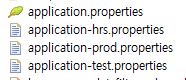
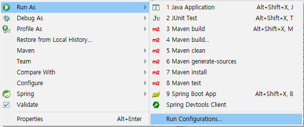
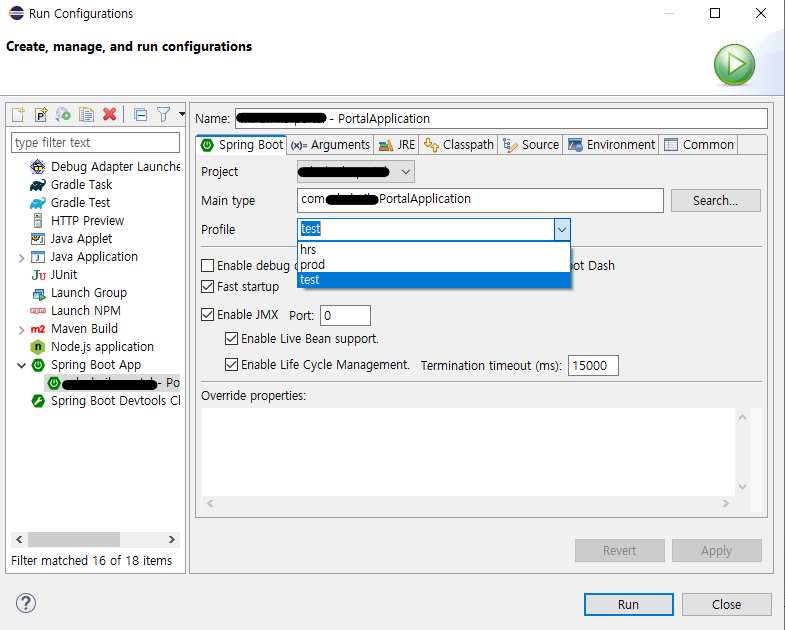

# SpringBoot Profile
## .properties
- 자바 응용프로그램 내에서 사용되는 설정과 관련된 변수들을 파일에다 쓰고, 이를 읽어오는 방식에 사용됨.
    - 외부에서 파일을 넣을 수도 있고, 프로젝트 내부적으로 넣어서 사용할 수도 있음.

## application.properties
 - **스프링부트**가 어플리케이션을 구동할때 자동으로 로딩하는 파일
    - 설정내용으로는 아래와 같은 항목들이 존재.
        - context-path
        - port
        - logging level
        - database connection info
        - mybatis setting 등
- 프로젝트 실행시 로컬/개발서버/운영서버와 같이 다양한 실행환경이 존재하므로, 하나의 properties 파일을 사용할 경우 <U>**환경에 맞게 설정값을 변경해줘야하는 불편함이 존재.**</U>

## application-[local/dev/prod/···/test].properties
- 문법 : application-{이름}.properties
- 실행환경에 따라 properties 파일내용을 일일이 수정하지 않기 위해선, 프로젝트 실행환경마다 각각의 properties 파일을 생성해주면 됨.
- 실행환경에 따라 설정 변수 값이 다르게 적용되는 경우가 많은데, 이럴때 개발환경에 따라 각각의 프로퍼티를 사용하면 다르게 사용되는 값들을 하나하나 다 바꿔주는 번거로운 일을 하지 않을 수 있다.
- 프로퍼티 사용
    ```
    # application-local.properties

    # api source
    api.callback.url=aaa.aaa.a.aa:aaaa
    api.auth.key=aaaa123
    api.master.idx=1
    ```
    ```
    # application-prod.properties

    # api source
    api.callback.url=bbb.bbb.b.bb:bbbb
    api.auth.key=bbbb123
    api.master.idx=2
    ```
    ```
    // TestController

    @Controller
    public class TestController {
        
        @Value("${api.auth.key}")
        private String authKey;
    }
    ```
    - @Value("${key}") 어노테이션을 사용하여 설정변수명을 적어주면, 프로퍼티 파일이 실행환경에 따라 변경되어도 설정변수명은 동일하므로 코드 수정없이 간편하게 실행환경을 바꾸어 기동가능하다.

## 애플리케이션 기동시, profile설정

### **Eclipse 에서**
- 실행환경에 따른 여러개의 .properties파일을 생성해준다.

    

- 실행하고자하는 프로젝트 → 우클릭 → Run As → Run Configurations... 클릭
    
    

- SpringBoot탭에 profile항목에서 생성해둔 properties파일 목록을 확인할 수 있으며, 실행하려는 환경에 맞는 설정파일을 선택해주면 된다.
    
    

### **터미널 에서**
- **java -jar (어플리케이션 파일명).jar**
    - 기본적으로 터미널을 통해 어플리케이션을 구동하는 명령어
    - 이때는 기본 설정 파일인 application.properties 파일이 적용된다. 
- **java -jar -Dspring.profiles.active={이름} (어플리케이션 파일명).jar**
    - application-dev.properties 사용
        - 명령어 : java -jar -Dspring.profiles.active=dev (어플리케이션 파일명).jar
    - application-prod.properties 사용
        - 명령어 : jara -jar -Dspring.profiles.active=prod (어플리케이션 파일명).jar
