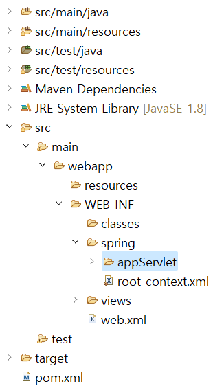
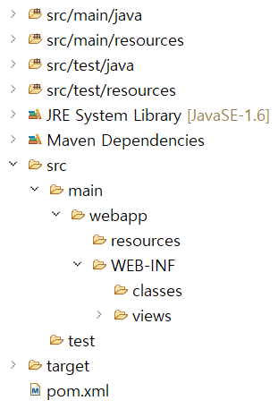

Chapter 01. 개발준비
=

>## 1. Spring 버전에 따른 JDK 버전
- Spring은 버전에 따라 JDK의 제한이 있으므로 주의하기
    - Spring 5.x의 경우 JDK 1.8이상
    - Spring 4.x의 경우 JDK 1.6이상
    - Spring 3.x의 경우 JDK 1.5이상


>## 2. Java Configuration
- Spring Legacy Project의 경우 xml기반으로 스프링 관련 설정을 하도록 되어있다. 그러나 Spring 3 버전 이후에는 Java클래스 파일을 이용하는 설정을 지원하면서 점차 xml이 아닌 Java 설정을 이용하는 경우가 증가하고 있다.
- Java 설정을 하는 방법은 우선 web.xml을 삭제하고 spring 폴더 내에 있는 xml파일들도 전부 다 삭제한다. (전 / 후)
    <center>
        <table>
            <tbody>
                <tr>
                    <td>
                        <span>(전)</span>
                        
                    </td>
                    <td>
                        <span>(후)</span>
                        
                    </td>
                </tr>
            </tbody>
        </table>
    </center>

- web.xml을 삭제하면 pom.xml에서 에러가 발생하는데 이건 과거의 웹 프로젝트들이 기본적으로 web.xml을 사용하는 것이 default였기 때문. 이를 해결하기 위해 pom.xml의 하단부에 아래 코드를 추가한다.
    ```
    <plugin>
        <groupId>org.apache.maven.plugins</groupId>
        <artifactId>maven-war-plugin</artifactId>
        <version>3.2.0</version>
        <configuration>
            <failOnMissingWebXml>false</failOnMissingWebXml>
        </configuration>
    </plugin>
    ```

- pom.xml의 스프링 버전도 변경 → 5.0.7.RELEASE 
- Java 버전 변경 → 1.8
- 컴파일 관련 버전 변경 → ${java.version}
- Java설정을 이용하는 경우, xml 대신 설정 파일을 직접 작성할 필요가 있다. 스프링은 @Configuration이라는 어노테이션으로 해당 클래스의 인스턴스로 설정파일을 대신할 수 있게끔 지원한다.