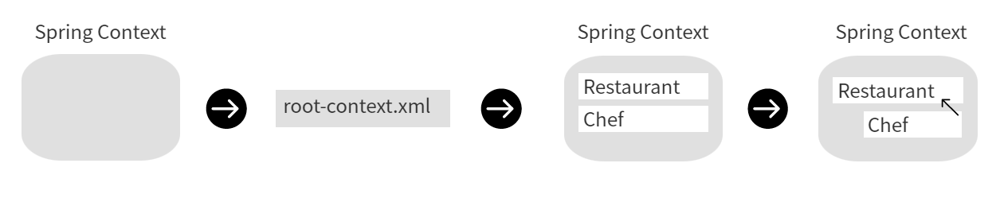
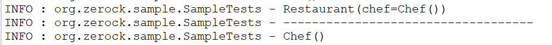

Chapter 02. 스프링의 특징과 의존성 주입
=

>## 1. 프레임워크
- 뼈대나 근간을 이루는 코드들의 묶음
- 프레임워크를 이용하면 개발에 필요한 구조는 이미 완성된 상태.


>## 2. Spring Framework의 특징
- 일반적인 Java의 클래스와 인터페이스를 이용하는 구조 ⇒ 경량화
- 어느 한 분야에 집중된 프레임워크가 아니고, 전체를 설계하는 용도로 사용 ⇒ 프로젝트 전체 구조를 설계할때 유용
- 전체구조에 집중함으로써 특정한 영역의 프레임워크와 공존하는 방식으로 사용 가능. 다른 프레임워크들과의 통합을 지원함.
- OOP 구조를 뒷받침하고 구조를 설계하는 사상 ⇒ <U>*의존성 주입*</U>
    ```
    의존성 주입이란,
    - 의존성 : 하나의 객체가 다른 객체 없이 제대로 된 역할을 수행할 수 없다.
    - 주입 : 외부에서 밀어넣다.

    ※ 의존성 주입 : 어떤 객체가 필요한 객체를 외부에서 밀어넣는다.  

    스프링은 ApplicationContext라는 존재가 필요한 객체들을 생성하고, 필요한 객체들을 주입해주는 방식.
    ApplicationContext가 관리하는 객체들을 Bean이라고 하고, Bean과 Bean 사이의 의존관계를 처리하는 방식으로   
    1)XML설정, 2)어노테이션 설정, 3)Java설정 방식을 이용할 수 있다.
    ```


>## 3. 의존성 주입 실습
- 3-1. bean 등록하기
    - @Component   
        - 개발자가 직접 작성한 class를 bean으로 등록하는 어노테이션   
        - 해당 어노테이션을 이용하여 ApplicationContext에 해당 객체를 Bean으로 등록하기 위해선 어노테이션 설정도 필요하지만, root-context.xml에 해당 클래스를 직접 설정해줘야 한다.
    - 등록하기   
        - (1) root-context.xml에 namespace 탭에 가서 context항목을 체크해줌   
        - (2) 아래와 같이 Beam으로 등록하고자 하는 패키지 경로를 root-context.xml에 추가함. 현재 코드는 org.zerock.sample 패키지 하위에 있는 파일들은 Bean으로 등록시켜 Spring에서 관리해달라는 의미. (물론 해당 파일들에 @Conponent 어노테이션이 붙어있어야 함)
            ```
            <context:component-scan base-package="org.zerock.sample"></context:component-scan>
            ```

         - (3) Beans Graph 탭에 가보면 @Component어노테이션이 붙은 객체들을 확인할 수 있다.
    - cf .   
        - root-context.xml : 스프링 프레임워크에서 관리해야하는 객체(Bean)를 설정하는 설정파일
        - @Bean : 개발자가 작성한 method를 통해 반환되는 객체를 bean으로 등록하는 어노테이션
        - 만약 xml이 아닌 java설정을 통해 bean을 등록하고 싶으면, RootConfig클래스를 하나 만들어서 해당 클래스에   
        <U>**@Configuration**</U> : 해당 클래스의 인스턴스를 이용하여 설정파일(.xml)을 대체하겠다.   
        <U>**@ComponentScan( basePackages = { ”org.zerock.sample” } )**</U> : 해당 패키지의 하위 클래스들을 Bean으로 설정해달라 ! 물론 @Component어노테이션이 붙은 클래스에 한해   
        와 같은 어노테이션을 적용하면 Java설정으로 .xml설정파일들을 대신할 수 있다.

- 3-2. 등록된 bean을 @Autowired하면 해당 bean객체를 주입받을 수 있음
    ```
    // Chef 클래스를 만들고 Bean으로 등록
    @Component
    @Data
    public class Chef{ 

    }

    // Restaurant클래스를 만들고 Bean으로 등록
    @Component
    @Data
    public class Restaurant{

        // @Autowired 어노테이션을 통해 Restaurant클래스는 Chef를 주입받도록 설정
        @Setter(onMethod_ = @Autowired)
        private Chef chef;

    }
    ```


>## 4. Spring 동작방식
- 동작방식
    <center>
        
    </center>

    1. 스프링 프레임워크가 시작되면 스프링이 사용하는 메모리영역이 생성. 이를 Context라고 부르며, 스프링에서는 ApplicationContext라는 이름의 객체가 생성
    2. 스프링은 자신이 객체를 생성하고 관리해야하는 객체들에 대한 설정이 필요. 이에 대한 설정은 root-context.xml을 참조
    3. root-context.xml에 설정되어 있는 <context:component-scan> 태그 내용을 통해 org.zerock.sample 패키지를 스캔함.
    4. 해당 패키지 내 클래스 중에 @Component 어노테이션이 존재하는 클래스의 인스턴스들을 생성함(Bean으로 등록)
    5. Restaurant 객체는 Chef객체가 필요하다는 어노테이션(@Autowired) 설정을 확인하고 스프링은 Chef객체의 레퍼런스를 Restaurant 객체에 주입함.

- 테스트 코드로 확인하기
    ```
    import static org.junit.Assert.assertNotNull;

    import org.junit.Test;
    import org.junit.runner.RunWith;
    import org.springframework.beans.factory.annotation.Autowired;
    import org.springframework.test.context.ContextConfiguration;
    import org.springframework.test.context.junit4.SpringJUnit4ClassRunner;

    import lombok.Setter;
    import lombok.extern.log4j.Log4j;

    @RunWith(SpringJUnit4ClassRunner.class)
    @ContextConfiguration("file:src/main/webapp/WEB-INF/spring/root-context.xml")
    @Log4j
    public class SampleTests {

        @Setter(onMethod_ = {@Autowired})
        private Restaurant restaurant;
        
        @Test
        public void textExist() {
            assertNotNull(restaurant);
            
            log.info(restaurant);
            log.info("-----------------------------------");
            log.info(restaurant.getChef());
            
        }
    }
    ```

- 테스트 결과
    <center></center>
    
    1. @RunWith(SpringJUnit4ClassRunner.class) : 현재 테스트 코드가 스프링을 실행하는 역할을 할 것이다라고 알림
    2. ContextConfiguration : 지정된 클래스나 문자열을 이용하여 필요한 객체들을 스프링 내 Bean으로 등록하게 함. (여기선 Restaurant와 Chef 클래스)   
    3. @Autowired 를 통해 Restaurant를 스프링으로부터 자동으로 주입해달라고 설정
    4. assertNotNull() : null값이면 테스트 실패. 해당 메소드를 통해 restaurant가 빈으로 등록되어 restaurant 변수에 의존성 주입이 되었는지 확인. 만약 의존성 주입이 실패하여 restaurant변수가 null값이면 해당 테스트는 실패함.
    5. log로 restaurant을 찍어보니 Restaurant(chef = Chef()) 객체 확인가능. restaurant.getChef() 를 찍어보니 Chef() 객체 확인가능.

- 의의
    - new키워드를 이용하여 객체를 생성한 적이 없는데도 객체가 생성됨.   
    → Spring은 관리가 필요한 객체(Bean)를 어노테이션 등을 이용하여 객체를 생성하고 관리하는 일종의 ‘컨테이너’나 ‘팩토리’의 기능을 가짐.
    - Restaurant 객체의 Chef 인스턴스 변수에 Chef타입의 객체가 주입됨.   
    → Spring은 @Autowired 와 같은 어노테이션을 이용하여 개발자가 직접 객체들과의 관계를 관리하지 않고, 자동으로 관리되도록 함.


>## 5. 사용된 어노테이션 정리
- @Component : 해당 클래스가 스프링에서 객체(Bean)로 만들어서 관리하는 대상임을 명시.
- @Autowired : 스프링 내부에서 자신이 특정한 객체에 의존적이므로 자신에게 해당 타입의 빈을 주입해주라는 표시.   
(이때, 해당 객체는 Component 어노테이션을 이용하여 Bean으로 등록되어있어야 함)
- @ContextConfiguration : 테스트 관련 중요 어노테이션. 스프링이 실행되면서 어떤 설정 정보를 읽어들여야하는지를 명시.
- @RunWith : 테스트 시 필요한 클래스를 지정. 스프링의 경우는 SpringJUnit4ClassRunner 라고 설정해주면 테스트 실행시 스프링을 실행할 것임을 지정해줄 수 있음.


>## 6. 단일 생성자의 묵시적 자동주입(Spring 4.3~)
- Spring 4.3 이후에는 단일 생성자의 묵시적 자동 주입이 허용됨.   
생성자를 선언하고 Chef를 주입받도록 할 때, @Autowired 없이 처리가 가능해짐.
    ```
    // 기존
    public class SampleHotel {
        
        @Autowired
        private Chef chef;

        public SampleHotel(Chef chef){
            this.chef = chef;
        }

    }

    // 스프링 4.3 이후
    public class SampleHotel {
        
        private Chef chef;

        public SampleHotel(Chef chef){
            this.chef = chef;
        }

    }
    ```

- [주의] 만약 단일생성자가 아닐 경우에 @Autowired 를 생략하면 에러가 발생한다.
    ```
    // 클래스
    public class SampleHotel {
        
        private Chef chef;
        private int room;
        
        // 생성자 1
        public SampleHotel(Chef chef){
            this.chef = chef;
        }

        // 생성자 2
        public SampleHotel(Chef chef, int room){
            this.chef = chef;
            this.room = room;
        }
    }


    // 테스트 코드
    @RunWith(SpringJUnit4ClassRunner.class)
    @ContextConfiguration("file:src/main/webapp/WEB-INF/spring/root-context.xml")
    @Log4j
    public class HotelTests {

        @Setter(onMethod_ = {@Autowired})
        private SampleHotel hotel;
        
        @Test
        public void textExist() {
            assertNotNull(hotel);
            
            log.info(hotel);
            log.info("-----------------------------------");
            log.info(hotel.getChef());
            
        }
    }
    ```

    ```
    // 테스트 결과
    WARN : org.springframework.context.support.GenericApplicationContext - Exception encountered during context initialization - cancelling refresh attempt: org.springframework.beans.factory.BeanCreationException: Error creating bean with name 'sampleHotel' defined in file [C:\Users\LG\workspace-sts\ex00\target\classes\org\zerock\sample\SampleHotel.class]: Instantiation of bean failed; nested exception is org.springframework.beans.BeanInstantiationException: Failed to instantiate [org.zerock.sample.SampleHotel]: No default constructor found; nested exception is java.lang.NoSuchMethodException: org.zerock.sample.SampleHotel.<init>()
    ERROR: org.springframework.test.context.TestContextManager - Caught exception while allowing TestExecutionListener [org.springframework.test.context.support.DependencyInjectionTestExecutionListener@3ffc5af1] to prepare test instance [org.zerock.sample.HotelTests@437da279]
    java.lang.IllegalStateException: Failed to load ApplicationContext
    ```

    단일 생성자가 아닌 상황에서 @Autowired를 걸어주지 않으면 다음과 같이 Bean을 찾지 못했고, 따라서 ApplicationContext를 로드하지 못했다는 에러가 발생한다.