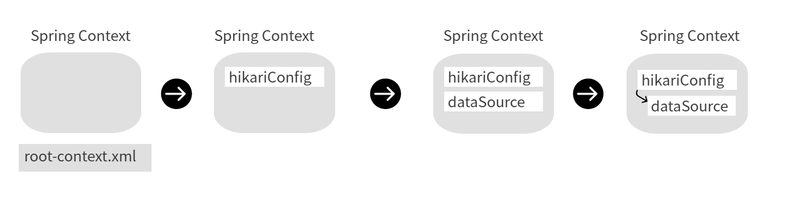
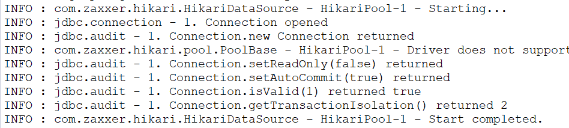

Chapter 03. 스프링과 Oracle Database 연동
=

>## 1. 오라클 및 SQL Developer 설치
- https://www.oracle.com
- SQL Developer는 <U>*내부적으로 JDBC를 이용하여*</U> 데이터베이스와 연결을 처리한다.   
때문에 SQL Developer에서 연결이 불가능하다면 프로그램을 작성해도 제대로 동작하지 않을 가능성이 높다.


>## 2. 프로젝트의 JDBC연결
- Oracle DB의 JDBC Driver는 11g까지 공식적으로 Maven을 지원하지 않기 때문에 직접 jar파일을 프로젝트에 추가시키기
    1. SQL Developer 설치 경로에 jdbc/lib폴더에 JDK 8버전용 ojdbc8.jar파일이 존재
    2. 프로젝트를 선택하여 Build Path를 이용해서 ojdbc8.jar를 경로에 추가   
    : 프로젝트 우클릭 - Build Path - Configure Build path …
    3. **<U>나중에 war파일로 만들때도 jar가 포함될 수 있도록 Web Deployment Assembly항목에도 jar추가</U>**   
    : 프로젝트 우클릭 - Build Path - Configure Build path …  - Deployment Assembly
    4. **<U>만약 테스트할 때는 정상적이고, Tomcat에서 JDBC드라이버에 문제가 생겼다고 나온다면 Web Deployment Assembly를 확인해보기 ! </U>**


>## 3. 커넥션 풀 설정
- 일반적으로 여러 명의 사용자를 동시에 처리해야 하는 웹 애플리케이션의 경우, 데이터베이스 연결을 이용할 때 Connection Pool을 이용   
→ 아예 스프링에 커넥션 풀을 등록하여 사용하는 것이 좋음
- Java에서는 DataSource라는 인터페이스를 통해 커넥션 풀을 사용한다.
- 커넥션 풀을 사용하는 이유는, Datasource를 통해 매번 데이터베이스와 연결하는 방식이 아닌, 미리 연결을 맺어주고 반환하는 구조를 이용하여 성능 향상을 꾀할 수 있기 때문.
- 예제에선 HikariCP를 이용
    - pom.xml 설정
        ```
        <!-- https://mvnrepository.com/artifact/com.zaxxer/HikariCP -->
        <dependency>
            <groupId>com.zaxxer</groupId>
            <artifactId>HikariCP</artifactId>
            <version>2.7.4</version>
        </dependency>
        ```
    
    - root-context.xml 설정
        ```
        <?xml version="1.0" encoding="UTF-8"?>
        <beans xmlns="http://www.springframework.org/schema/beans"
            xmlns:xsi="http://www.w3.org/2001/XMLSchema-instance"
            xmlns:context="http://www.springframework.org/schema/context"
            xsi:schemaLocation="http://www.springframework.org/schema/beans https://www.springframework.org/schema/beans/spring-beans.xsd
                http://www.springframework.org/schema/context http://www.springframework.org/schema/context/spring-context-4.3.xsd">
            
            <!-- Root Context: defines shared resources visible to all other web components -->
            <bean id="hikariConfig" class="com.zaxxer.hikari.HikariConfig">
                <property name="driverClassName"
                    value="oracle.jdbc.driver.OracleDriver"></property>
                <property name="jdbcUrl"
                    value="jdbc:oracle:thin:@localhost:1521:XE"></property>
                <property name="username" value="book_ex"></property>
                <property name="password" value="book_ex"></property>
            </bean>
            
            <!-- HikariCP configuration -->
            <bean id="dataSource" class="com.zaxxer.hikari.HikariDataSource"
                destroy-method="clone">
                <constructor-arg ref="hikariConfig" />	
            </bean>
            
            <context:component-scan base-package="org.zerock.sample"></context:component-scan>
        </beans>
        ```
    
    - root-context.xml   
    : 스프링이 로딩되면서 읽어들이는 문서. 주로 이미 만들어진 클래스들을 스프링의 Bean으로 등록할 때 사용한다.   
    → 프로젝트에 직접 작성하는 클래스들은 어노테이션을 이용하는 경우가 많고, 외부 jar파일 등으로 사용하는 클래스들은 bean태그를 이용해서 작성하는 경우가 많다.

- 스프링이 시작되면 root-context.xml을 읽어서 아래와 같은 형태로 id가 dataSource인 객체가 처리됨   
(root-context.xml을 살펴보면 id가 dataSource인 bean이 hikariConfig를 참조하고 있음)
    <center>
        
    </center>


>## 4. 테스트코드로 확인해보기
- 테스트 코드는 스프링에 bean으로 등록된 DataSource를 이용하여 Connection을 제대로 처리할 수 있는지 확인하도록 작성.
    ```
    @RunWith(SpringJUnit4ClassRunner.class)
    @ContextConfiguration("file:src/main/webapp/WEB-INF/spring/root-context.xml")
    @Log4j
    public class DataSourceTests {
        
        @Setter(onMethod_ = {@Autowired})
        private DataSource dataSource;
        
        @Test
        public void testConnection() {
            try (Connection con = dataSource.getConnection()){
                log.info(con);
            } catch (Exception e) {
                fail(e.getMessage());
            }
        } 
    }
    ```
    
    이를 실행해보면 내부적으로 HikariCP가 시작되고, 종료되는 로그를 확인할 수 있다.
    <center><center>

